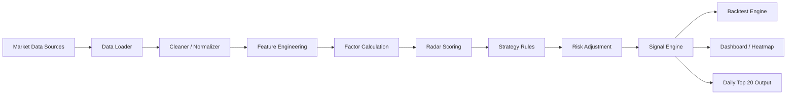
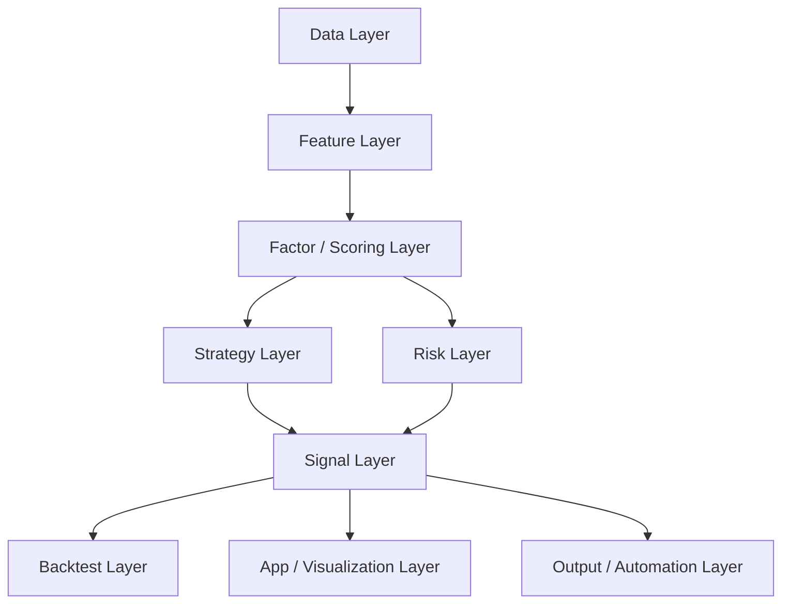
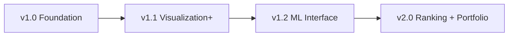

# Taiwan Gushi AI Radar

[](https://github.com/rabbit68116-ux/taiwan-gushi-ai-radar)


Open-source Taiwan stock market research, scoring, signal, and backtesting framework.

> A public build log for an AI-native Taiwan stock research stack: from data pipeline to radar scoring, from signal generation to backtest and dashboard.

[繁體中文](#繁體中文) | [English](#english)

---

## 繁體中文

### 專案介紹

**Taiwan Gushi AI Radar** 是一個專為台灣股票市場打造的開源量化研究框架。  
它的目標不是提供不可解釋的黑盒投資建議，而是建立一套真正可以被研究、驗證、展示、持續擴充的台股研究系統。

這個專案把量化研究常見卻分散的流程，整合成一條完整資料鏈：

- 從市場資料載入開始
- 經過資料清理與統一 schema
- 計算技術面、量價、籌碼、基本面與市場特徵
- 產生雷達評分與觀測排序
- 輸出買入、賣出、觀察與風險警示訊號
- 用回測檢驗規則有效性
- 最後以 dashboard 與 heatmap 視覺化展示

對想做台股 AI、量化選股、回測驗證、研究工具開發的人來說，這不是一份零散筆記，而是一個可以持續演進的工程骨架。

### 這個 repo 現在包含什麼

除了架構文件，repo 現在已經開始整理成一個可直接給 AI agent 使用的台股 skill：

| 路徑 | 作用 |
|---|---|
| [`SKILL.md`](./SKILL.md) | agent 的核心工作流與判斷規則 |
| [`references/taiwan-market-playbook.md`](./references/taiwan-market-playbook.md) | 台股市場判斷、因子與風險規則 |
| [`references/prediction-framework.md`](./references/prediction-framework.md) | 預測輸出格式、情境推演與信心框架 |
| [`references/github-landscape.md`](./references/github-landscape.md) | 參考 GitHub 熱門量化與回測專案後整理出的設計模式 |
| [`agents/openai.yaml`](./agents/openai.yaml) | skill UI metadata |

這代表後續不只是在做一個專案介紹頁，而是在建立一個真的能讓 agent 學會「如何分析台股」的 reusable skill。

### 專案亮點

| 亮點 | 說明 |
|---|---|
| 專注台股 | 結構從第一天就以台股資料、上櫃市場、族群輪動、籌碼與市場 regime 為核心 |
| 可解釋 | 分數會拆出 Trend、Volume、Capital Flow、Quality、Sector、Market、Risk 等構面 |
| 可回測 | 所有規則預期都能落成程式化回測，而不是停留在概念描述 |
| 可展示 | 規劃包含 dashboard、heatmap、daily top 20、markdown summary 等展示層 |
| AI-ready | 預留 `model_score`、`probability`、`expected_return`、`ranking_model` 供未來 ML 擴充 |

### 使用者會得到什麼

- 一套可維護的台股研究專案結構
- 一個可逐步擴充的 feature engineering 與 scoring pipeline
- 一個可持續驗證策略的 backtest 基礎
- 一個能讓使用者快速理解市場狀態的 dashboard MVP
- 一份可每日自動輸出的 Top 20 觀測清單

### 視覺化架構圖



### 模組地圖



### 核心能力

| 模組 | 內容 |
|---|---|
| Data | 台股資料載入、來源切換、欄位標準化、驗證 |
| Features | 技術面、動能、量價、籌碼、基本面、族群、市場特徵 |
| Scoring | 100 分制雷達評分、正規化、排序與可信度處理 |
| Regime | Bull / Sideways / Bear / High Volatility 市場環境判斷 |
| Risk | 風險旗標、風險分數、停損停利、倉位過濾 |
| Signals | Strong Buy Watch / Buy Watch / Hold / Sell Watch / Risk Alert |
| Backtest | 日頻回測、交易成本、滑價、績效報表 |
| Visualization | Streamlit dashboard、sector heatmap、relative strength heatmap |
| Automation | 每日自動掃描、Top 20 匯出、GitHub Actions / cron job |

### 雷達評分概念

預設會以 100 分制處理，並保留可調權重：

| 構面 | 預設權重 |
|---|---:|
| Trend | 20 |
| Volume | 15 |
| Capital Flow | 20 |
| Quality | 10 |
| Momentum | 10 |
| Sector | 10 |
| Market | 5 |
| Risk Adjustment | -20 ~ 0 |

分數不是預測保證，而是觀測排序。  
高分代表更值得進一步研究，不代表一定上漲；低分代表風險或條件不足，不代表一定下跌。

### 預期輸出樣貌

每日掃描完成後，專案預期會輸出類似內容：

```text
Top 20 Radar Watchlist
Date: 2026-03-12

1. 2330 台積電   Radar Score: 86   Signal: Strong Buy Watch
2. 2454 聯發科   Radar Score: 83   Signal: Buy Watch
3. 2303 聯電     Radar Score: 81   Signal: Buy Watch
...
```

以及：

- `output/daily_top20.csv`
- `output/daily_top20.json`
- `output/daily_summary.md`

### 這個專案適合誰

- 想研究台股量化策略的開發者
- 想把選股流程做成資料化、規則化、可回測化的交易者
- 想建立公開作品集或金融研究 demo 的工程師
- 想把規則式框架進一步接上 LightGBM、XGBoost、ranking model 的研究者
- 想追蹤一個 AI 原生金融研究系統從架構到落地過程的使用者

### 為什麼現在值得追蹤

- 這個 repo 已經不是模糊想法，而是有完整工程藍圖與模組邊界
- 發展路線明確，後續每次更新都會是可見的實作里程碑
- 適合長期追蹤：從資料層到前端展示層都會逐步補齊
- 如果你對「AI 如何參與金融研究框架建設」有興趣，這會是一個值得觀察的公開案例

### Roadmap

**Phase 1**
- Data loader
- Feature pipeline
- Radar scoring
- Signal engine
- Basic backtest

**Phase 2**
- Streamlit dashboard MVP
- Daily auto scan
- Markdown / CSV / JSON export

**Phase 3**
- Market heatmap
- Sector rotation page
- Historical scan archive

### 發展路線圖



### 目前狀態

目前 repo 已放入 v1.0 架構文件，接下來會逐步完成：

1. repo 基礎結構
2. 資料載入與統一 schema
3. 特徵工程 pipeline
4. 因子與雷達評分
5. 訊號與回測引擎
6. dashboard、heatmap 與 daily scan

架構文件：
- [`taiwan-gushi-ai-radar-architecture-v1.0-final.md`](./taiwan-gushi-ai-radar-architecture-v1.0-final.md)

### 風險聲明

本專案僅供研究、教育與工程實作用途。  
所有分數、排序、訊號與回測結果均不構成投資建議或保證報酬。

---

## English

### Overview

**Taiwan Gushi AI Radar** is an open-source research framework built specifically for the Taiwan stock market.  
Its goal is not to produce opaque trading calls, but to create a research system that is explainable, backtestable, extensible, and publicly visible.

The project is designed as a full pipeline:

- ingest market data
- clean and normalize it into a unified schema
- compute technical, volume, capital-flow, fundamental, sector, and market features
- generate radar scores and ranked watchlists
- emit buy, sell, hold, and risk-alert signals
- validate rules through backtesting
- present results through dashboards, heatmaps, and daily scan outputs

For anyone building Taiwan-market AI, quant research tools, ranking systems, or public finance demos, this repository is meant to be a strong foundation rather than a loose collection of notes.

### What This Repo Now Includes

Beyond the architecture note, this repository is now being structured as a reusable skill for AI agents:

| Path | Purpose |
|---|---|
| [`SKILL.md`](./SKILL.md) | Core workflow and reasoning rules for the agent |
| [`references/taiwan-market-playbook.md`](./references/taiwan-market-playbook.md) | Taiwan-specific factor, regime, and risk logic |
| [`references/prediction-framework.md`](./references/prediction-framework.md) | Forecast formatting, scenario framing, and confidence discipline |
| [`references/github-landscape.md`](./references/github-landscape.md) | Design patterns extracted from leading open-source quant repos |
| [`agents/openai.yaml`](./agents/openai.yaml) | Skill metadata for UI surfaces |

This shifts the repo from a concept page into a real skill bundle that can teach an AI agent how to reason about Taiwan stocks.

### Why It Stands Out

| Highlight | Description |
|---|---|
| Taiwan-first | Built around Taiwan market structure, OTC behavior, sector rotation, capital flow, and market regimes |
| Explainable | Scores are decomposed into trend, volume, capital flow, quality, sector, market, and risk components |
| Backtest-first | Strategy logic is expected to become executable and measurable, not just conceptual |
| Demo-friendly | Planned outputs include dashboard views, heatmaps, Top 20 watchlists, and markdown summaries |
| AI-ready | Interfaces reserve room for `model_score`, `probability`, `expected_return`, and `ranking_model` |

### What Users Can Expect

- A maintainable project structure for Taiwan equity research
- A scalable feature engineering and scoring pipeline
- A backtesting foundation for validating strategy ideas
- A dashboard layer that makes market state easy to read
- A daily automated watchlist output for repeatable market scanning

### Visual Architecture


### Layer Map


### Core Capabilities

| Module | Scope |
|---|---|
| Data | Taiwan data ingestion, provider switching, schema normalization, validation |
| Features | Technical, momentum, volume, capital flow, fundamentals, sector, and market features |
| Scoring | 100-point radar scoring, normalization, ranking, and confidence handling |
| Regime | Bull, sideways, bear, and high-volatility detection |
| Risk | Risk flags, risk score, stop-loss / take-profit, position filters |
| Signals | Strong Buy Watch, Buy Watch, Hold, Sell Watch, Risk Alert |
| Backtest | Daily-frequency testing, fees, slippage, and performance reports |
| Visualization | Streamlit dashboard, sector heatmap, relative-strength heatmap |
| Automation | Daily scan, Top 20 export, GitHub Actions or cron-based scheduling |

### Radar Scoring Logic

The default scoring structure is designed around a 100-point framework:

| Component | Default Weight |
|---|---:|
| Trend | 20 |
| Volume | 15 |
| Capital Flow | 20 |
| Quality | 10 |
| Momentum | 10 |
| Sector | 10 |
| Market | 5 |
| Risk Adjustment | -20 ~ 0 |

A high score does not mean guaranteed upside.  
A low score does not mean guaranteed downside.  
The score is meant to rank research priority and market quality, not to promise returns.

### Expected Output Snapshot

```text
Top 20 Radar Watchlist
Date: 2026-03-12

1. 2330 TSMC       Radar Score: 86   Signal: Strong Buy Watch
2. 2454 MediaTek   Radar Score: 83   Signal: Buy Watch
3. 2303 UMC        Radar Score: 81   Signal: Buy Watch
...
```

Planned output files:

- `output/daily_top20.csv`
- `output/daily_top20.json`
- `output/daily_summary.md`

### Who Should Follow This

- Developers building Taiwan stock research infrastructure
- Traders who want systematic and backtestable selection logic
- Engineers building finance demos or public open-source portfolios
- Researchers who want to connect rule-based systems with LightGBM, XGBoost, or ranking models
- Anyone interested in watching an AI-native market research framework grow in public

### Why Follow or Star Now

- The project already has a concrete engineering blueprint
- The scope is broad but clearly segmented into modules and milestones
- Progress will be visible and incremental, which makes the repo easy to track
- It is an early-stage public build of a Taiwan-market AI research framework, which is still relatively rare

### Roadmap

**Phase 1**
- Data loader
- Feature pipeline
- Radar scoring
- Signal engine
- Basic backtest

**Phase 2**
- Streamlit dashboard MVP
- Daily auto scan
- Markdown / CSV / JSON export

**Phase 3**
- Market heatmap
- Sector rotation page
- Historical scan archive

### Development Timeline


### Current Status

The repository currently contains the v1.0 architecture document. The next implementation stages will focus on:

1. repository structure
2. data loading and unified schemas
3. feature pipelines
4. factor and radar scoring
5. signal and backtest engine
6. dashboard, heatmap, and daily scan outputs

Architecture document:
- [`taiwan-gushi-ai-radar-architecture-v1.0-final.md`](./taiwan-gushi-ai-radar-architecture-v1.0-final.md)

### Disclaimer

This project is for research, education, and engineering purposes only.  
Scores, rankings, signals, and backtest results are not investment advice and do not guarantee returns.
